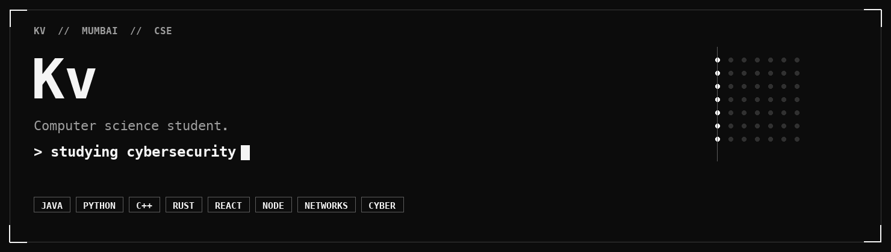

  

  
  
  
  
  
  

Computer science, in Mumbai. I build small systems a person can still read a month later, and I study cybersecurity and computer networking with the degree.

A program should say what it keeps. What it stores, what it sends, and what it can finish without calling home.

Java, Python, and C++ are where the structure gets settled. JavaScript and TypeScript take over once the work lives in a browser. React and Node.js are the interface and the server. C, Rust, and SQL sit on the same bench.

## Now

- Cybersecurity and computer networking, studied on purpose
- Browser software in React and TypeScript
- Java, Python, and C++ until the structure is plain

## Skills

### Languages

The set I actually write in.

  
  
  
  
  
  
  
  
  
  
  
  

### Web

The part a person touches, and the server behind it.

  
  
  
  
  

### Networking

TCP/IP, DNS, HTTP, and the OSI model. Wireshark when I want the packets in front of me.

  
  
  
  
  
  

### Cybersecurity

Coursework I am taking seriously. Cryptography, the network, the web, and a bias toward keeping less.

  
  
  
  
  

### Tools

Linux, Git, and the databases the projects already use.

  
  
  
  
  
  
  
  

## GitHub

  
  

  

  

